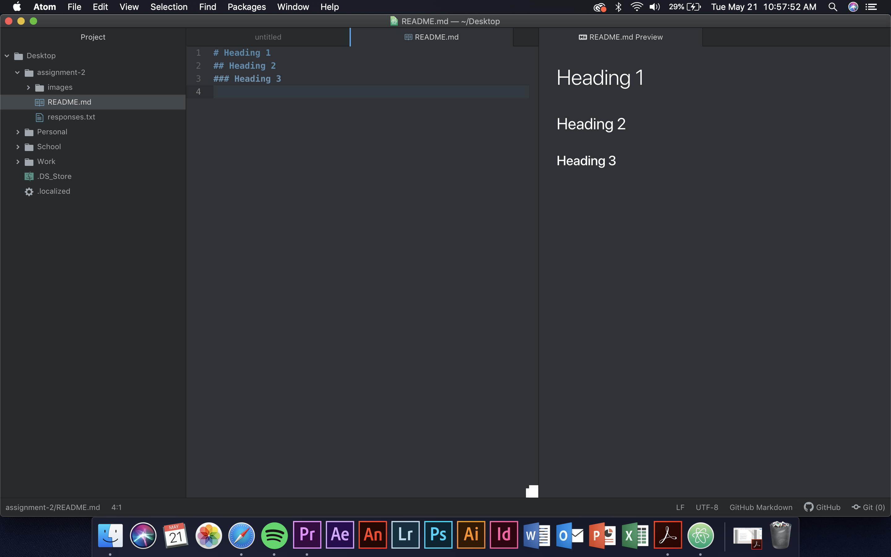

# Heading 1
## Alex Ramsey

I decided to take this class to understand how to build a website. I do photography and videography side work and I'd love
to build my own website.

I have already learned how to create headings, add a url and add a screenshot. When I started this class I had zero previous
knowledge of how to code.

[Netflix](https://www.netflix.com/)

[My response](./responses.txt)

