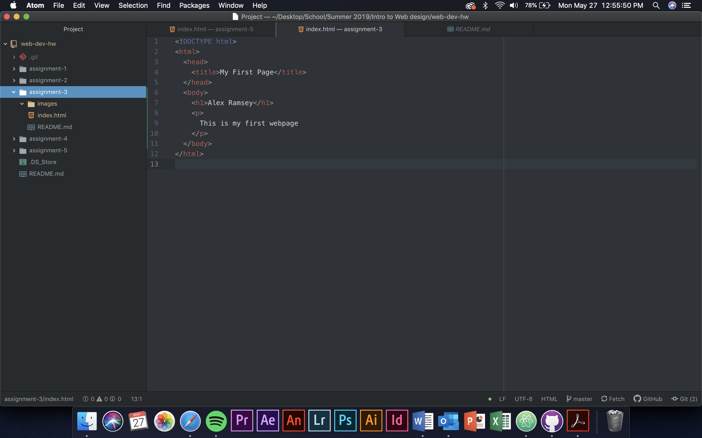

Bowsers use a rendering engine and a browser engine. The rendering engine
typically gathers html code and renders the webpage you are tying to view. The
browser engine directs actions between the user interface and the rendering
engine.

A markup language determines how a webpage will be structured. One that is used
frequently is HTML. HTML stands for Hyper Text Markup Language and uses tags.

