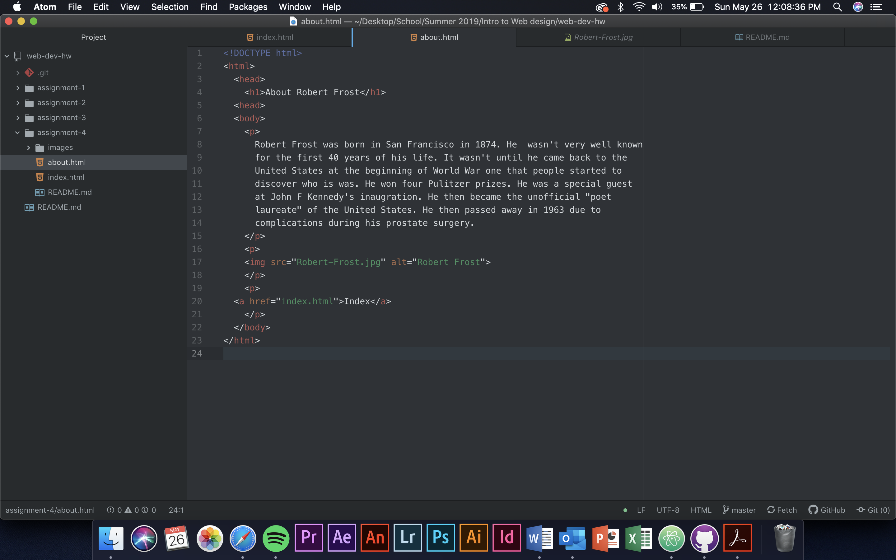

1. I went mlb.com. It was a lot darker of a page than it is now. Also it looks
like they utilize the whole screen now. Back then there were large margins on
both sides of the page. The color scheme has changed a lot. It is a lot easier
to navigate now than it use to be.
2. I thought it was pretty easy to understand the Git module. It makes it easier
to upload your code to the website.

